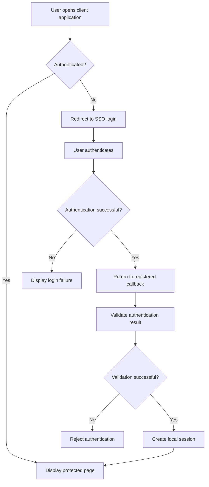

# SSO System Architecture

## Overview

The SSO system separates authentication from client application functionality. The Gateway handles the central authentication process, while each client application manages its own application pages and local session.

## Main Components

### Gateway

The Gateway is the central ASP.NET Core application. It handles the authentication-related functionality implemented by the project, including login, callback processing, and logout where supported.

### MockClient

The MockClient is a sample client application used to test communication with the Gateway and verify the authentication flow.

### Data and Models

These components support the application's data structures and persistence requirements. The exact responsibilities depend on the implementation in the repository.

### External Client Applications

Client applications may be built using ASP.NET Core MVC, PHP, React, or Node.js/Express. Each client must follow the authentication protocol supported by the Gateway.

## Authentication Flow

## Flow Description

1. The user visits a protected resource in a client application.
2. The client determines whether the user has an active local session.
3. If no session exists, the client redirects the user to the SSO service.
4. The Gateway authenticates the user using the mechanism implemented by the system.
5. After successful authentication, the Gateway returns the user to a registered callback.
6. The client validates the returned authentication result.
7. If validation succeeds, the client creates a local session and grants access to protected resources.

## Token Handling

If the SSO implementation returns a JWT, the client must validate the token's signature, issuer, audience, and expiration as required by the token configuration.

A decoded JWT is not automatically trustworthy. The client must verify the token before using its claims for authorization.

If the Gateway uses an authorization code or another callback mechanism, follow that protocol instead of assuming a JWT is returned directly.

## Logout Flow

The logout process depends on the Gateway's implementation.

A typical client logout process is:

1. Clear the client's local authentication session.
2. Expire or invalidate the local authentication cookie.
3. Redirect to the SSO logout endpoint if supported and required.
4. Return the user to an approved public page.

Clearing a local session does not necessarily terminate every other application session.

## Configuration Requirements

Each client integration should define:

* SSO base URL.
* Login endpoint.
* Callback URL.
* Logout endpoint, if supported.
* Client identifier and credentials, if required.
* JWT validation settings, if JWTs are used.

Use the actual routes and settings defined in the Gateway project.
