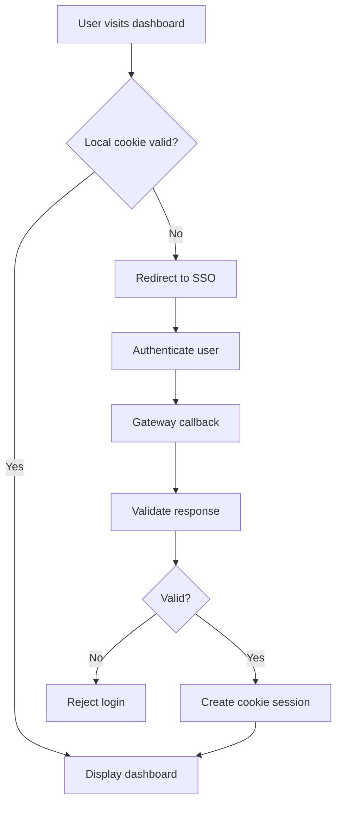

# ASP.NET Core MVC Integration Guide

## Overview

This guide describes how an ASP.NET Core MVC client can integrate with the SSO Gateway using cookie authentication.

The examples demonstrate the client-side structure. The SSO login route, callback parameters, and token-validation settings must match the actual Gateway implementation.

## 1. Configure appsettings.json

Add an SSO section to the client's `appsettings.json`:

```json
{
  "Sso": {
    "BaseUrl": "https://localhost:7001",
    "LoginPath": "/Account/Login",
    "CallbackPath": "/Account/Callback"
  }
}
```

These URLs are examples. Replace them with the actual Gateway address and supported endpoints.

## 2. Configure Cookie Authentication in Program.cs

Install the ASP.NET Core authentication packages appropriate for your target framework if they are not already included.

```csharp
using Microsoft.AspNetCore.Authentication.Cookies;

var builder = WebApplication.CreateBuilder(args);

builder.Services.AddControllersWithViews();

builder.Services
    .AddAuthentication(CookieAuthenticationDefaults.AuthenticationScheme)
    .AddCookie(options =>
    {
        options.Cookie.Name = "ExampleClient.Auth";
        options.LoginPath = "/Account/Login";
        options.AccessDeniedPath = "/Account/AccessDenied";
        options.Cookie.HttpOnly = true;
        options.Cookie.SecurePolicy =
            builder.Environment.IsDevelopment()
                ? CookieSecurePolicy.SameAsRequest
                : CookieSecurePolicy.Always;
        options.Cookie.SameSite = SameSiteMode.Lax;
        options.SlidingExpiration = true;
        options.ExpireTimeSpan = TimeSpan.FromMinutes(30);
    });

builder.Services.AddAuthorization();

var app = builder.Build();

if (!app.Environment.IsDevelopment())
{
    app.UseExceptionHandler("/Home/Error");
    app.UseHsts();
}

app.UseHttpsRedirection();
app.UseStaticFiles();

app.UseRouting();

app.UseAuthentication();
app.UseAuthorization();

app.MapDefaultControllerRoute();

app.Run();
```

The example configures a local cookie session. It does not implement the Gateway protocol by itself.

## 3. AccountController.cs

The login action should redirect the user to the actual SSO login endpoint. The callback must validate the authentication response before creating a local session.

```csharp
using Microsoft.AspNetCore.Authentication;
using Microsoft.AspNetCore.Authentication.Cookies;
using Microsoft.AspNetCore.Mvc;
using System.Security.Claims;

public class AccountController : Controller
{
    private readonly IConfiguration _configuration;

    public AccountController(IConfiguration configuration)
    {
        _configuration = configuration;
    }

    [HttpGet]
    public IActionResult Login()
    {
        var baseUrl = _configuration["Sso:BaseUrl"];

        if (string.IsNullOrWhiteSpace(baseUrl))
            return Problem("SSO base URL is not configured.");

        // Replace this with the actual Gateway login route
        // and the required registered callback parameter.
        var callbackUrl = Url.Action(
            nameof(Callback),
            "Account",
            values: null,
            protocol: Request.Scheme);

        var loginUrl = $"{baseUrl.TrimEnd('/')}/REPLACE-WITH-LOGIN-ENDPOINT";

        // Add callbackUrl using the parameter required by the Gateway.
        // Validate callback URLs and use state/nonce protections as
        // required by the actual SSO protocol.

        return Redirect(loginUrl);
    }

    [HttpGet]
    public async Task<IActionResult> Callback()
    {
        // TODO: Read the actual callback parameters.
        // Validate the authorization code, token, or authentication
        // response using the protocol implemented by the Gateway.
        //
        // Do not create an authenticated session until validation
        // has succeeded.

        return Problem(
            "Implement callback validation using the actual SSO protocol.");
    }

    [HttpPost]
    [ValidateAntiForgeryToken]
    public async Task<IActionResult> Logout()
    {
        await HttpContext.SignOutAsync(
            CookieAuthenticationDefaults.AuthenticationScheme);

        // Redirect to the Gateway logout endpoint here only if
        // the Gateway supports and requires remote logout.
        return RedirectToAction("Index", "Home");
    }
}
```

**Important:** The login and callback actions contain explicit implementation placeholders. Do not deploy them as a working SSO integration until the correct protocol, callback validation, and claim mapping are implemented.

## 4. DashboardController.cs

After a validated identity has been stored in the local cookie, protected controllers can access its claims.

```csharp
using Microsoft.AspNetCore.Authorization;
using Microsoft.AspNetCore.Mvc;
using System.Security.Claims;

[Authorize]
public class DashboardController : Controller
{
    public IActionResult Index()
    {
        var email = User.FindFirst(ClaimTypes.Email)?.Value
                    ?? User.FindFirst("email")?.Value;

        var name = User.Identity?.Name;

        var groups = User.FindAll("groups")
            .Select(claim => claim.Value)
            .ToList();

        var level = User.FindFirst("level")?.Value;

        ViewBag.Email = email;
        ViewBag.Name = name;
        ViewBag.Groups = groups;
        ViewBag.Level = level;

        return View();
    }
}
```

The claim names must match those mapped from the validated Gateway response. Some group claims may be represented as multiple claims or as a single array, depending on the token and mapping code.

## 5. Dashboard View

Create `Views/Dashboard/Index.cshtml`:

```html
@{
    ViewData["Title"] = "Dashboard";
}

<h1>Dashboard</h1>

<p>Name: @ViewBag.Name</p>
<p>Email: @ViewBag.Email</p>
<p>Level: @ViewBag.Level</p>

<h2>Groups</h2>
<ul>
@foreach (var group in ViewBag.Groups)
{
    <li>@group</li>
}
</ul>
```

## 6. Integration Flow



## 7. Testing Checklist

* Confirm the Gateway is running.
* Confirm the configured SSO base URL is correct.
* Register the exact callback URL if the Gateway requires registration.
* Implement and test callback validation.
* Verify that expired or invalid tokens are rejected.
* Verify that protected pages require authentication.
* Confirm logout clears the local cookie.
* Verify the expected claims are available after login.
